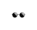

# Image-replacer   
A chrome extension which replaces all images on the tab with a given image.   
     
How to Install:    
* Clone the Image-repacer repository    
* Open chrome and select extensions from the tools menu and enable developer mode      
* Click on load unpacked in the extensions page 
* Select the repo folder
* Open any tab containing images on chrome       
* Click on Image-replacer Icon and select any image from the dropdown list      
* Click on submit, Voila!      
